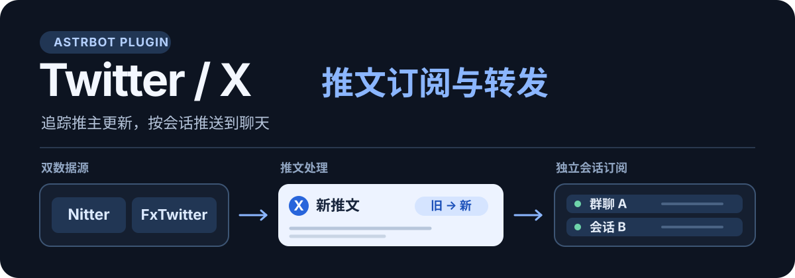
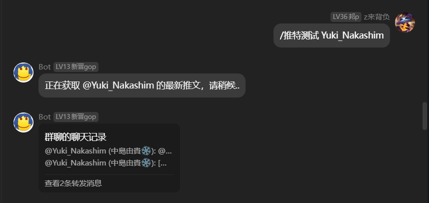
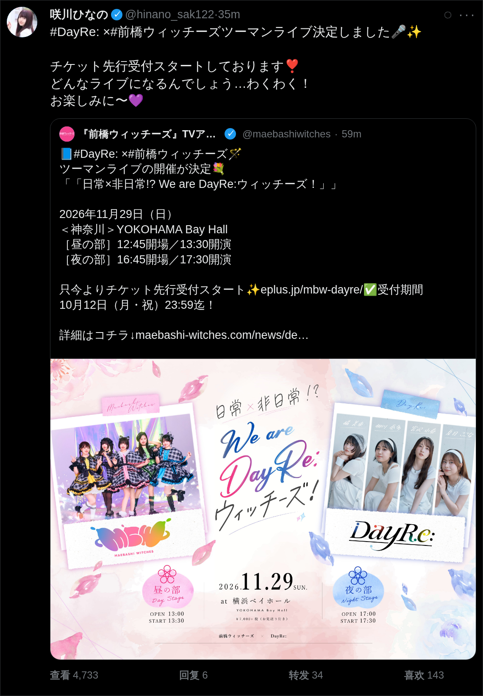
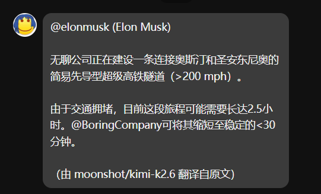
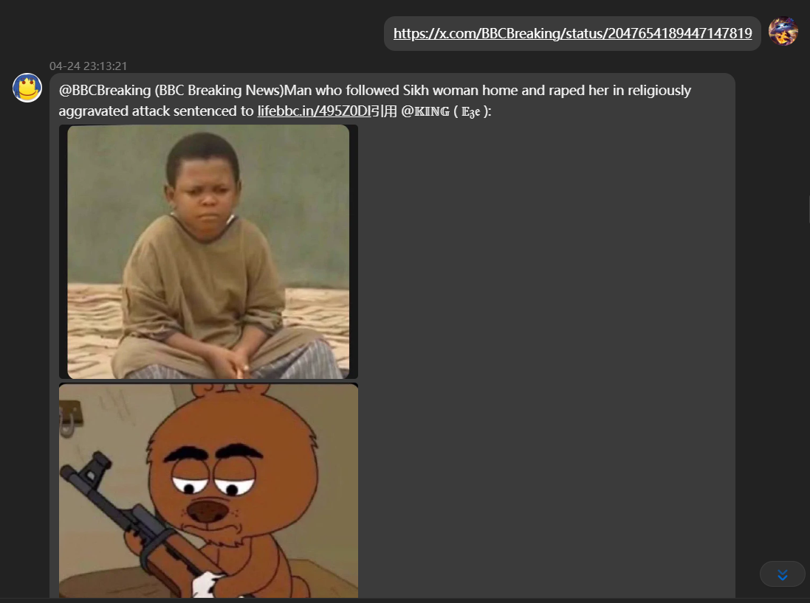
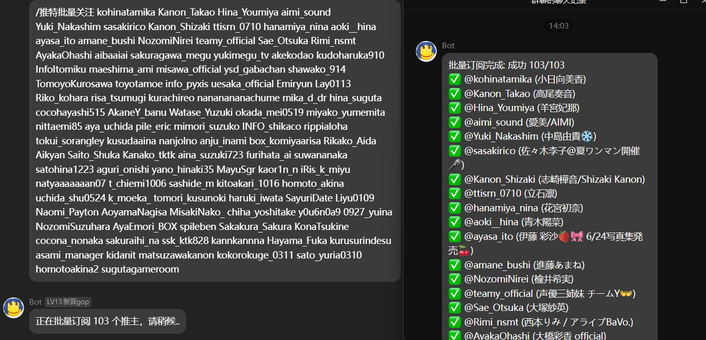
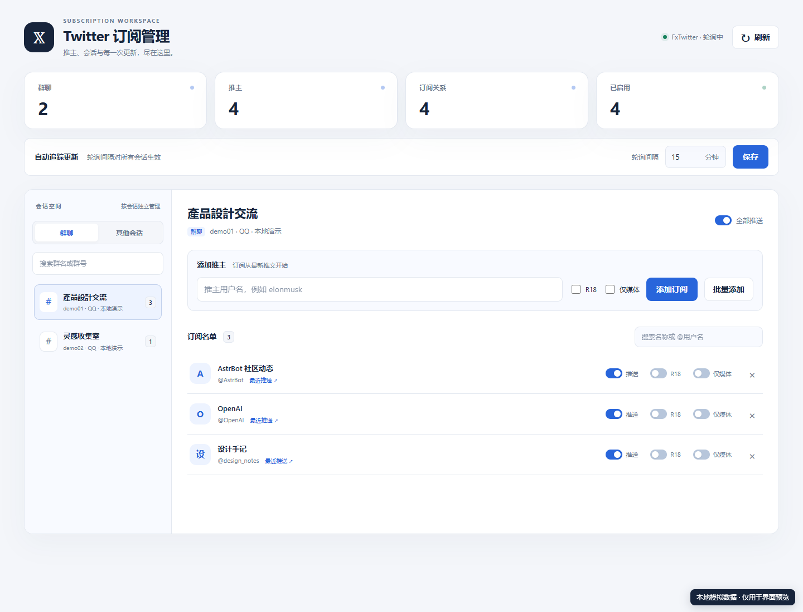

<div align="center">


# Twitter 推文转发

将关注的 X/Twitter 推文自动送到 AstrBot 会话；也可在聊天中解析链接、翻译推文，并通过 WebUI 管理订阅。

[](https://github.com/AstrBotDevs/AstrBot)
[](https://www.python.org/)
[](./LICENSE)

**[快速开始](#快速开始) · [效果展示](#效果展示) · [指令](#聊天指令) · [配置](#配置参考)**

</div>



## 效果展示

推文可按普通消息或合并转发发送；截图模式可将正文渲染成仿推特风格的时间线卡片。

<p align="center"><strong>合并转发推送</strong><br></p>

<p align="center"><strong>截图模式 · 仿推特风格渲染</strong><br><a href="./asset/readme/tweet-screenshot-render.png"></a></p>

<details>
<summary>展开查看翻译、链接识别与批量关注效果</summary>

**推文翻译**



**链接识别**



**批量关注**



</details>

## 快速开始

1. 将本仓库放入 AstrBot 的插件目录，进入该目录后，在 AstrBot 使用的 Python 环境中安装依赖：

   ```bash
   pip install -r requirements.txt
   ```

2. 在 AstrBot 中加载插件。默认数据源是 Nitter；请配置可用的 `twitter_nitter_url`，或将 `twitter_data_provider` 改为 `fxtwitter`，保存后重载插件。FxTwitter 使用第三方公开 API，不需要 Nitter 镜像。
3. 在要接收推送的会话中发送 `/推特关注 <用户名>`，然后用 `/推特测试 <用户名>` 检查消息效果；发送 `/推特列表` 可查看当前会话的订阅。

首次将新推主加入插件时，会以当前最新推文建立增量游标，之后的自动轮询推送新内容；需要立即查看一条推文时可使用 `/推特测试`。

## 主要功能

- **按会话订阅**：群聊、私聊各自维护订阅与推送开关；支持指令和 WebUI 管理。
- **定时追踪**：从 Nitter 或 FxTwitter 读取增量推文，按旧到新推送；每个推主每轮可限制推送数量。
- **消息呈现**：支持普通消息、单条或集体合并转发、深浅色截图、图片与视频，以及可选的转帖去重。
- **按需解析与翻译**：手动或自动解析 `twitter.com` / `x.com` 链接；配置 LLM Provider 后可翻译推文正文。

### WebUI 订阅管理

在支持 **Plugin Pages API** 的 AstrBot 版本中，可从 Dashboard 打开“Twitter 订阅管理”。页面提供会话搜索、订阅开关、R18 与仅媒体设置、群级推送开关和轮询间隔调整。

下图使用**模拟数据**展示 WebUI，不是真实群聊或推送记录。



选中已连接的群聊后，可单个或批量添加推主。批量输入支持换行、空格、逗号与分号分隔，每批最多 100 个不同的有效账号；执行时可停止后续请求，已成功的添加不会撤销。点开某位推主可查看该会话最近 **5 条成功推送**的文字摘要、时间与原帖链接；记录保存在订阅数据中，插件重载后仍可查看，不保存媒体文件。旧订阅在此功能上线前的推送不会补录。

旧版 AstrBot 若缺少 Plugin Pages API，插件主体仍可加载，订阅可继续通过聊天指令管理。

## 聊天指令

指令作用于**当前会话**，除非下表另有说明。`<用户名>` 可填写推主 ID，关注时也可带 `@`。

| 指令 | 英文别名 | 作用 |
| --- | --- | --- |
| `/推特关注 <用户名> [r18] [媒体]` | `/twitter_follow` | 关注推主；可选允许 R18、仅推送含媒体的内容 |
| `/推特批量关注 <用户1> <用户2> ... [r18] [媒体]` | `/twitter_batch_follow` | 批量关注，选项应用于本次所有推主 |
| `/推特取关 <用户名>` | `/twitter_unfollow` | 取消当前会话中的订阅 |
| `/推特批量取关 <用户1> <用户2> ...` | `/twitter_batch_unfollow` | 批量取消当前会话中的订阅 |
| `/推特列表` | `/twitter_list` | 以分段合并转发列出当前会话的订阅 |
| `/推特推送 <开启\|关闭>` | `/twitter_push` | 开关当前会话的全部推送 |
| `/推特测试 <用户名>` | `/twitter_test` | 立即获取并发送该推主的最新推文 |
| `/推特解析 <推文链接>` | `/twitter_parse` | 手动解析指定推文链接 |
| `/推特清空订阅` | `/twitter_clear_all` | 清空所有会话的订阅；需要 AstrBot 管理员权限 |

`/推特列表` 会把完整列表分成多个合并转发节点，每段最多 50 条订阅、正文不超过 1000 个字符；名称较长时每段可能少于 50 条。

## 配置参考

在 AstrBot 插件配置页面设置以下选项。默认值与当前 `_conf_schema.json` 一致；旧版顶层扁平配置仍可读取。

| 常用配置 | 默认值 | 用途 |
| --- | --- | --- |
| `twitter_data_provider` | `nitter` | 选择 `nitter` 或 `fxtwitter` |
| `twitter_nitter_url` | 空 | 自定义 Nitter 镜像地址；只在 Nitter 模式使用 |
| `twitter_fxtwitter_api_base` | `https://api.fxtwitter.com` | FxTwitter API 地址；只在 FxTwitter 模式使用 |
| `twitter_poll_interval` | `5` | 轮询间隔，单位为分钟 |
| `twitter_poll_max_tweets_per_user` | `5` | 每位推主每轮最多推送的条数 |
| `twitter_text_render_mode` | `text` | `text` 文字，或 `screenshot` 截图 |
| `twitter_translate_enabled` | `false` | 是否翻译推文正文 |

<details>
<summary>展开查看全部配置项</summary>

### 数据源与网络

| 配置项 | 默认值 | 说明 |
| --- | --- | --- |
| `twitter_data_provider` | `nitter` | `nitter` 抓取 HTML；`fxtwitter` 读取 JSON API |
| `twitter_nitter_url` | 空 | 自定义 Nitter 镜像地址 |
| `twitter_fxtwitter_api_base` | `https://api.fxtwitter.com` | FxTwitter API 基础地址 |
| `twitter_proxy` | 空 | 可选代理，例如 `http://127.0.0.1:7890` |
| `twitter_pre_download_media` | `false` | 配置代理后预下载图片与视频封面；失败时回退原 URL |
| `twitter_poll_interval` | `5` | 轮询间隔（分钟），建议不低于 3 |
| `twitter_poll_max_tweets_per_user` | `5` | 每位推主每轮最多推送条数，最小为 1 |

### 消息格式

| 配置项 | 默认值 | 说明 |
| --- | --- | --- |
| `twitter_use_node` | `true` | 单条推文使用合并转发 |
| `twitter_no_text` | `false` | 推文含媒体时不输出文字 |
| `twitter_text_render_mode` | `text` | `text` 文字，或 `screenshot` 截图 |
| `twitter_screenshot_theme` | `dark` | 截图使用 `dark` 或 `light` 主题 |
| `twitter_send_media_separately` | `true` | 正文或截图之外继续发送原图、视频及视频降级链接 |
| `twitter_image_quality` | `orig` | `large` 缩略图，或 `orig` 原图 |
| `twitter_video_max_size_mb` | `256` | 视频直发大小上限，超过后发送链接 |
| `twitter_collective_forward` | `false` | 将一轮轮询的多条推文汇总为合并转发；需同时开启 `twitter_use_node` |
| `twitter_collective_max_authors` | `5` | 单条集体转发消息中的最多推主数 |
| `twitter_include_tweet_link` | `true` | 在推送、测试和解析消息末尾附带帖子链接 |

### 内容与翻译

| 配置项 | 默认值 | 说明 |
| --- | --- | --- |
| `twitter_include_retweets` | `true` | 轮询与测试时包含转帖 |
| `twitter_deduplicate_retweets` | `false` | 同一原帖被多个推主转发时按会话去重 |
| `twitter_link_recognition_enabled` | `auto` | `auto` 自动解析、`command` 仅指令解析、`off` 关闭 |
| `twitter_translate_enabled` | `false` | 自动翻译推文正文；需要可用的 LLM Provider |
| `twitter_translate_target_lang` | `简体中文` | 翻译目标语言 |
| `twitter_translate_provider_id` | 空 | 指定 LLM Provider；留空时依次尝试当前会话与第一个可用 Provider |
| `twitter_translate_timeout_seconds` | `60` | 单条推文翻译的总时限（秒），超时回退原文 |
| `twitter_translate_custom_prompt_enabled` | `false` | 使用自定义翻译 system prompt |
| `twitter_translate_custom_prompt` | 内置提示词 | 自定义提示词，支持 `{target_lang}` 变量 |

</details>

## 使用前了解

- **Nitter 镜像**：nitter镜像站目前已不可用 2026/8/27；需要自行部署时可参考 [Nitter 项目](https://github.com/zedeus/nitter)及[本地部署教程](https://mib7kzqsrf5.feishu.cn/wiki/O1ztwWl3GiBc4AknKvIcyaKsnFb?from=from_copylink)。
- **FxTwitter 数据**：FxTwitter 是第三方公开 JSON API，并非 X/Twitter 官方 API；接口、限流和可用性由其服务决定。
- **历史补发范围**：本轮已读取但尚未处理的推文会在后续轮询继续尝试；如果停机时间过长、数据源分页不足或旧推文已不再可见，插件无法保证补齐完整历史。
- **会话隔离**：私聊和群聊分别保存订阅；在一处取关或关闭推送，不影响其他会话。
- **截图头像缓存**：截图模式会在 AstrBot 插件数据目录的 `avatar_cache` 中保存有界头像缓存，最多 200 项、总计 16 MiB；它不包含推文原图或视频，也不受独立媒体发送开关控制。

## 参考与反馈

本插件参考了 [nonebot-plugin-twitter](https://github.com/nek0us/nonebot-plugin-twitter) 的 Nitter 抓取思路、[astrbot_plugin_rsshub](https://github.com/FlanChanXwO/astrbot_plugin_rsshub) 的订阅管理与 KV 存储模式，以及 [astrbot_plugin_qq_group_daily_analysis](https://github.com/SXP-Simon/astrbot_plugin_qq_group_daily_analysis) 的 LLM Provider 选择思路。

项目代码由 Codex 辅助生成与迭代。遇到问题欢迎提交 [Issue](https://github.com/Ars1027/astrbot_plugin_twitter/issues)，也欢迎提交 Pull Request。代码采用 [MIT License](./LICENSE)。
